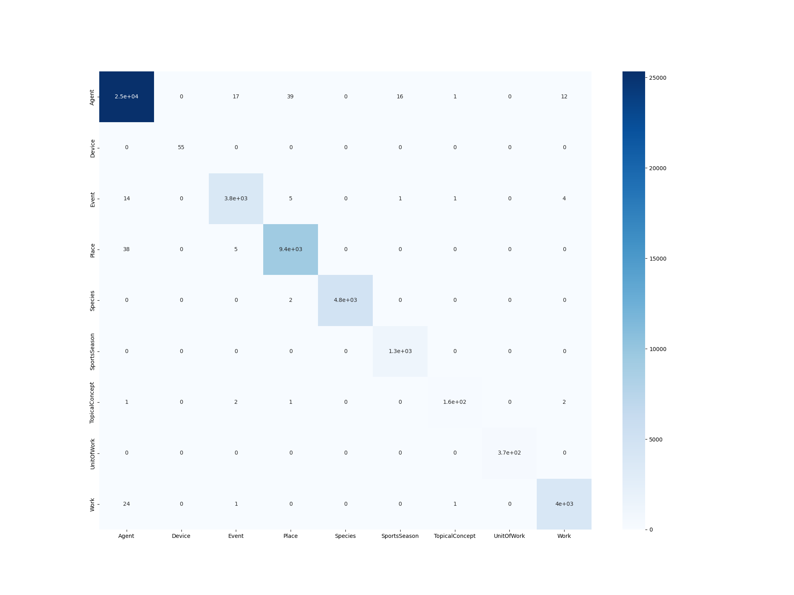

# PROJECT MODULE : EXPLAINABLE AI

## Overview
Welcome to our repository for the Explainable AI course taught as a Project Module as a part of Cognitive Systems master's program at the University of Potsdam! Artificial Intelligence has witnessed remarkable progress in recent years, permeating every aspect of our lives. As these AI systems become more sophisticated, understanding the reasoning behind their decisions has become increasingly crucial. The importance of transparency, fairness, and accountability in AI systems has led to the emergence of Explainable AI. 

In this course, our primary objective is to equip the knowledge and skills required to design, implement, and evaluate AI models that are not only accurate but also interpretable. We delve into various domains, including language, vision, and multimodal tasks, to explore different approaches and techniques for achieving explainability in AI systems. The course is divided into tasks, each focusing on a specific aspect of Explainable AI:

## Task: Language Task with Transformers and Feature Attribution Analysis:
For this task, we explored language-based datasets. Our goal is to implement a classification or regression model using pre-trained transformer models such as BERT, DistillBERT, or XLM-BERT and integrating LIME or SHAP techniques to generate explanations for the model's predictions. 

### Dataset
For this task we selected the [DBPedia_Classes](https://huggingface.co/datasets/DeveloperOats/DBPedia_Classes) dataset. The DBpedia dataset, derived from Wikipedia, is a valuable resource for extracting structured content and organizing it into taxonomic categories. This dataset consists of 342,782 Wikipedia articles that have been cleaned and classified into hierarchical classes. The classification system spans three levels, with 9 classes at the first level, 70 classes at the second level, and 219 classes at the third level. DBpedia has become a popular choice for NLP (Natural Language Processing) and text classification research, particularly as a baseline for evaluating models and algorithms. It offers a comprehensive taxonomy that enables researchers to explore various approaches and techniques in this field. 

### Model
We finetune the distilbert-base-uncased transformer model provided by [Huggingface](https://huggingface.co/distilbert-base-uncased). The DistilBERT model is introduced and described in detail in this [research paper](https://arxiv.org/abs/1910.01108), providing insights into its design and training process. DistilBERT is pretrained on a large corpus of text, following a self-supervised approach. Unlike supervised models that require human labeling, DistilBERT leverages the BERT base model as a teacher to generate inputs and labels automatically. This allows it to utilize publicly available data effectively. 

### Usage

1) After cloning the repository, the directory tree should look like this:

--TASK2

---figures

---label_vals

---results

---tables

---dataset_properties.ipynb

---helper.py

---lime_utils.py

---main.py

---predict.py

---train.py

 2) The next step is to generate the tokens from the raw data, prepare them for the model, and save them to disk. This can be done by running:

```python
python3 TASK2/main.py --prepare
```

3) To train the model (and save it) for Level 1 classification on these tokens:

```python
python3 TASK2/main.py --train1
```
4) To test the model for Level 1 classification and save the predictions and confusion matrix:

```python
python3 TASK2/main.py --predict
```

### Results
The tuning of the model for level 1 classification was done on an NVIDIA 1050Ti GPU. The tuning was done for the following set of parameters
*learning_rate=2e-5
*per_device_train_batch_size=8
*per_device_eval_batch_size=8
*num_train_epochs=2
*weight_decay=0.01

After 1st epoch:
{'eval_loss': 0.023077525198459625, 'eval_accuracy': 0.9955094252722309, 'eval_runtime': 2150.2467, 'eval_samples_per_second': 28.273, 'eval_steps_per_second': 3.534, 'epoch': 1.0}   
After 2nd epoch :
{'eval_loss': 0.021864905953407288, 'eval_accuracy': 0.9959042010724742, 'eval_runtime': 2302.6637, 'eval_samples_per_second': 26.402, 'eval_steps_per_second': 3.301, 'epoch': 2.0} 

The confusion matrix:




 

